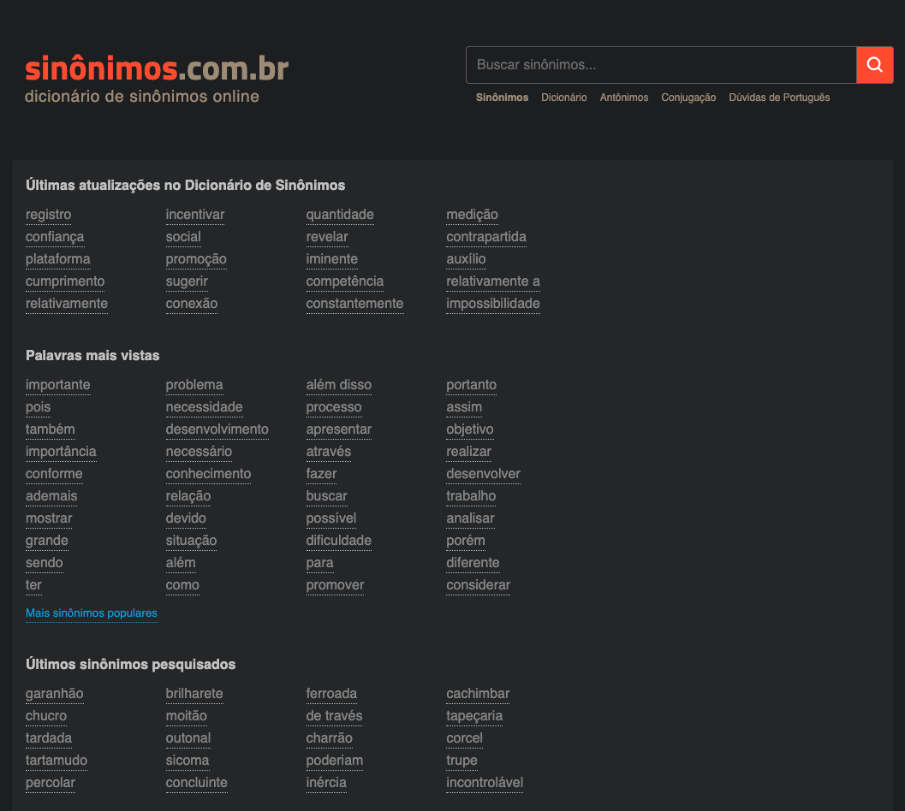
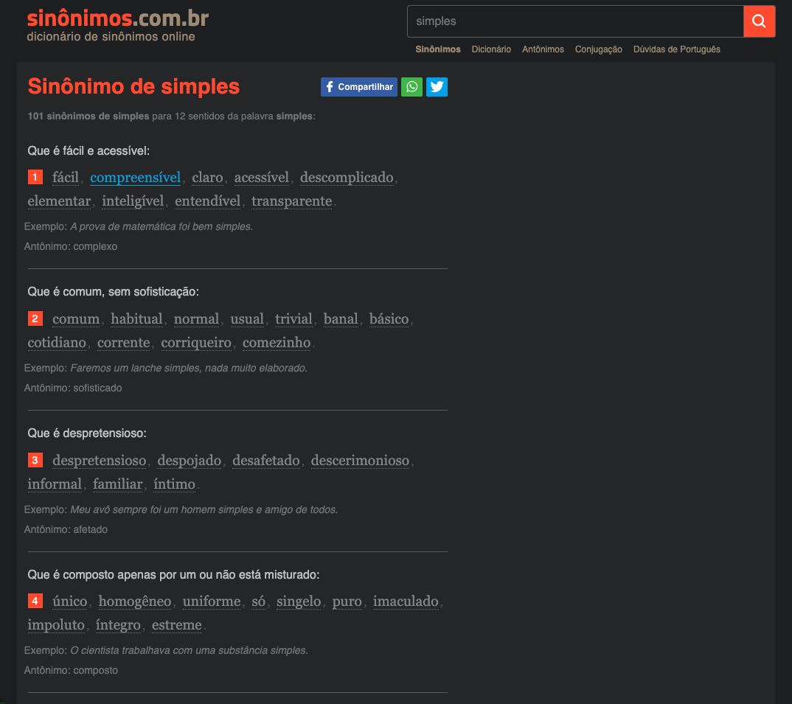

# ©️ Dark mode theme sinonimos.com.br

Pretty useful Google Chrome Extension to apply a dark mode theme to sinomimos.com.br web site 🤍

  

  

## 👩 Author

| [ <b>@laisfrigerio</b>](https://github.com/laisfrigerio)  |
| :---: |

## 📄 License

This project is licensed under the MIT License - see the LICENSE.md file for details
